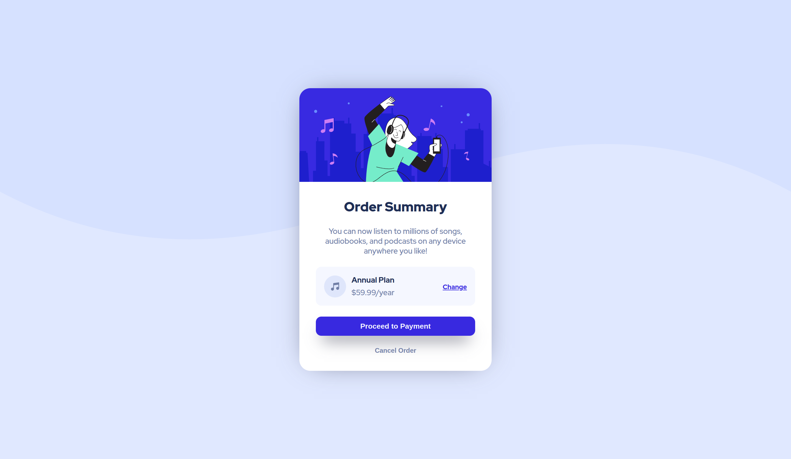

# order-summary-component---frontend-mentor

Another simple component from Frontend Mentor

# Frontend Mentor - Order summary card solution

This is a solution to the [Order summary card challenge on Frontend Mentor](https://www.frontendmentor.io/challenges/order-summary-component-QlPmajDUj).

### The challenge

Users should be able to:

- See hover states for interactive elements

### Screenshot

### Links

- Solution URL: [https://hombreombre.github.io/order-summary-component---frontend-mentor/](https://hombreombre.github.io/order-summary-component---frontend-mentor/)

### Built with

- Semantic HTML5 markup
- CSS custom properties
- Flexbox

## Author

- Frontend Mentor - [@HombreOmbre](https://www.frontendmentor.io/profile/HombreOmbre)
